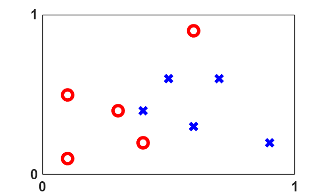
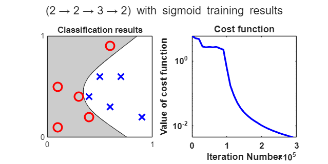
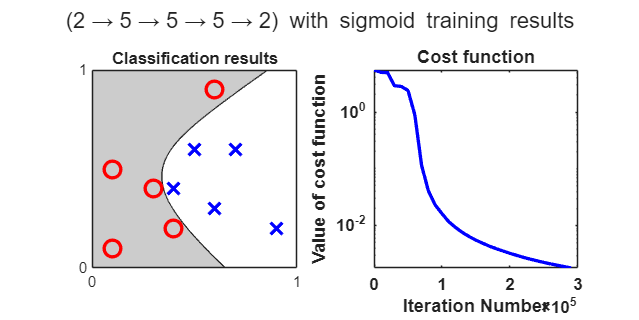
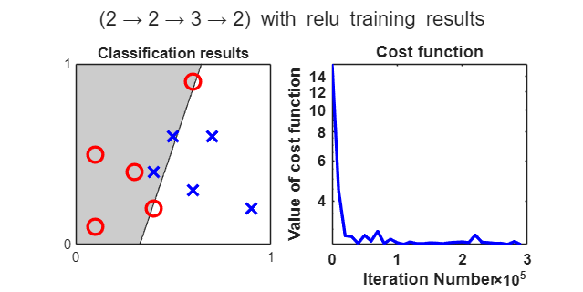
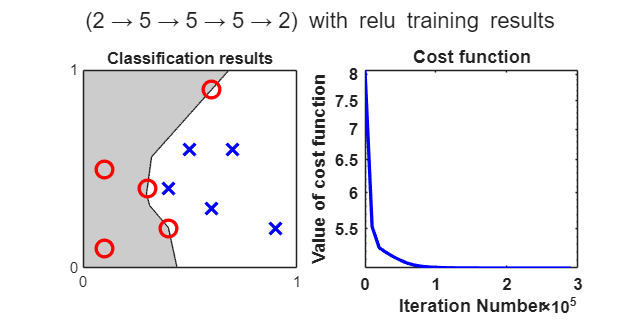
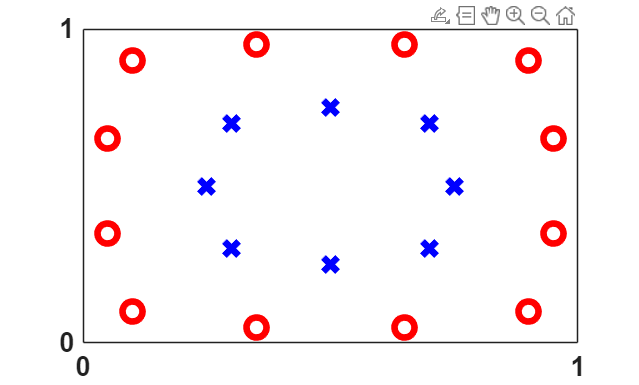
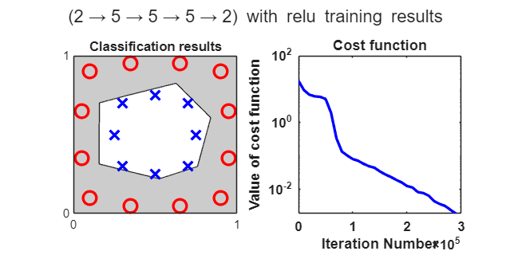

<a id="TMP_97b3"></a>

# Essentials of Deep Learning

In this project, we learn and play essential mathematical components of deep learning on a simple artificial neural network by using the MATLAB script provided by C. F. Higham and D. J. Higham along with their paper ''Deep Learning: An Introduction for Applied Mathematicians'', arXiv:1801.05894v1, Jan. 2018. Minor changes have been made to the original script.

<!-- Begin Toc -->

## Table of Contents
&emsp;[Set up the training data](#TMP_959e)
 
&emsp;[Expressions of backpropagation and stochastic gradient descent](#TMP_056f)
 
&emsp;[Training](#TMP_4370)
 
&emsp;[Behaviour on more complex dataset](#TMP_5137)
 
<!-- End Toc -->
<a id="TMP_959e"></a>

# Set up the training data
```matlab
addpath("./Code")

% Initial training data 
m = 5; 
n = 5; 
x1 = [0.1,0.3,0.1,0.6,0.4,0.6,0.5,0.9,0.4,0.7]; 
x2 = [0.1,0.4,0.5,0.9,0.2,0.3,0.6,0.2,0.4,0.6]; 
y = [ones(1,m) zeros(1,n); zeros(1,m) ones(1,n)]; 

% Plot the training data 
figure(2) 
clf 
a1 = subplot(1,1,1); 
plot(x1(1:m),x2(1:m),'ro','MarkerSize',12,'LineWidth',4) 
hold on 
plot(x1(m+1:m+n),x2(m+1:m+n),'bx','MarkerSize',12,'LineWidth',4) 
a1.XTick = [0 1]; 
a1.YTick = [0 1]; 
a1.FontWeight = 'Bold'; 
a1.FontSize = 16; 
xlim([0,1]) 
ylim([0,1])
```


<a id="TMP_056f"></a>

# Expressions of backpropagation and stochastic gradient descent

Consider a network with L layers, where each layer contains a single neuron. The input and output of each layer are scalars, except for the first input vector $x$.


Let's construct the network with the following notation: $X$ is the input, $y$ is the output and for every layer $i=2,3,\ldots,L$ 

 $$ z_i =w_i a_{i-1} +b_i $$ 

 $$ a_i =\sigma (z_i ) $$ 

With $\sigma$ being the activation function, $w_i$ and $b_i$ being the weight and bias of layer $i$. In this case, all $w_i$ and $b_i$ are scalars. Note that $\hat{y} =a_L$.


For layer 1, we have:

 $$ z_1 =w_1 x+b_1 \;\textrm{and}\;a_1 =\sigma (z_1 ) $$ 

With $w_1$ and $b_1$, being vectors.


The corresponding derivatives used in backpropagation are:

 $$ \frac{\partial L}{\partial w_L }=\frac{\partial L}{\partial z_L }\frac{\partial z_L }{\partial w_L }=a_{L-1} (\hat{y} -y) $$ 

 $$ \frac{\partial L}{\partial b_L }=\frac{\partial L}{\partial z_L }\frac{\partial z_L }{\partial b_L }=\hat{y} -y $$ 

For all $i=2,3,\ldots,L-1$ 

 $$ \frac{\partial L}{\partial w_i }=\frac{\partial L}{\partial z_i }\frac{\partial z_i }{\partial w_i }=\delta_i a_i $$ 

 $$ \frac{\partial L}{\partial b_i }=\frac{\partial L}{\partial z_i }\frac{\partial z_i }{\partial b_i }=\delta_i $$ 

 $$ \delta_i =\frac{\partial L}{\partial z_i }=\frac{\partial L}{\partial z_{i+1} }\frac{\partial z_{i+1} }{\partial z_i }=\delta_{i+1} \frac{\partial \big(w_{i+1} \sigma (z_i )+b_i \big)}{\partial z_i }=\delta_{i+1} w_{i+1} \sigma^{\prime } (z_i ) $$ 

For layer 1, $x$, $w_1$ and $b_1$ are vectors:

 $$ \frac{\partial L}{\partial w_1 }=\frac{\partial L}{\partial z_1 }\frac{\partial z_1 }{\partial w_1 }=\delta_1 x^T $$ 

 $$ \frac{\partial L}{\partial b_1 }=\frac{\partial L}{\partial z_1 }\frac{\partial z_1 }{\partial b_1 }=\delta_1 $$ 

 $$ \frac{\partial L}{x}=\frac{\partial L}{\partial z_1 }\frac{\partial z_1 }{\partial x}=\delta_1 \frac{\partial \big(w_1 x+b_1 \big)}{\partial x}=\delta_1 w_1^T \sigma^{\prime } (z_1 ) $$ 
<a id="TMP_4370"></a>

# Training

We test several architectures using sigmoid and ReLu activations.


First, we construct a network of 4 layers with respectively 2, 2, 3 and 2 neurons each in combined with sigmoid activation. The parameters are kept as follows: 

```matlab
eta = 0.05; % learning rate
Niter = 3e5; % total number of iterations, adjustable to your computational budget
[X,Y,Mval,savecost] = net_2_2_3_2_sig(m,n,x1,x2,y,eta,Niter);
```

```matlabTextOutput
Total training time: 3.4511
```



For the first model, training converges correctly, classifying the two groups.


The second model is a network of 5 layers with respectively 2, 5, 5, 5 and 2 neurons each still combined with sigmoid activation function. We keep the same learning rate and number iteration as above.

```matlab
[X,Y,Mval,savecost] = net_2_5_5_5_2_sig(m, n, x1, x2, y, eta, Niter);
```

```matlabTextOutput
Total training time: 4.1684
```



The deeper model converges faster and achieves similar accuracy to the first network, indicating improved optimization stability.


To construct the third model, we change activation function of model 1 into ReLu activation function for every layer and choose a learning rate equal to 0.0025.

```matlab
eta = 0.0025; % learning rate
Niter = 3e5; % total number of iterations, adjustable to your computational budget
[X,Y,Mval,savecost] = net_2_2_3_2_relu(m, n, x1, x2, y, eta, Niter);
```

```matlabTextOutput
Total training time: 2.6339
```



The third model fails to correctly classify the data. The ReLu activation introduces non\-linearity, but with too few neurons or layers, the network behaves almost linearly. This highlights the importance of model capacity when using piecewise\-linear activations.


The fourth model is the combination of the second one (2\-5\-5\-5\-2) and the relu activation function. For this model, we choose a learning rate equal to 0.0025

```matlab
[X,Y,Mval,savecost] = net_2_5_5_5_2_relu(m, n, x1, x2, y, eta, Niter);
```

```matlabTextOutput
Total training time: 3.5339
```



This last model succeeds in classifying the data despite some points that are at the limits of their class. In terms of convergence, this model is better than the first one. Indeed, the convergence is faster and can be considered as optimal for a number of  iterations equals to $10^5$.

<a id="TMP_5137"></a>

# Behaviour on more complex dataset
```matlab
% Initialize training data
m = 12; 
n = 8; 
x1 = [0.1,0.05,0.05,0.1,0.35,0.65,0.9,0.95,0.95,0.9,0.65,0.35,0.7,0.3,0.3,0.7,0.25,0.75,0.5,0.5]; 
x2 = [0.1,0.65,0.35,0.9,0.95,0.95,0.9,0.65,0.35,0.1,0.05,0.05,0.7,0.7,0.3,0.3,0.5,0.5,0.75,0.25]; 
y = [ones(1,m) zeros(1,n); zeros(1,m) ones(1,n)]; 
y = [ones(1,m) zeros(1,n); zeros(1,m) ones(1,n)];

% Plot the training data 
figure(2) 
clf 
a1 = subplot(1,1,1); 
plot(x1(1:m),x2(1:m),'ro','MarkerSize',12,'LineWidth',4) 
hold on 
plot(x1(m+1:m+n),x2(m+1:m+n),'bx','MarkerSize',12,'LineWidth',4) 
a1.XTick = [0 1]; 
a1.YTick = [0 1]; 
a1.FontWeight = 'Bold'; 
a1.FontSize = 16; 
xlim([0,1]) 
ylim([0,1])
```



To test further the models, we use this more complex dataset of points.

```matlab
eta = 0.0025; % learning rate
Niter = 3e5; % total number of iterations, adjustable to your computational budget
[X,Y,Mval,savecost] = net_2_5_5_5_2_relu(m, n, x1, x2, y, eta, Niter);
```

```matlabTextOutput
Total training time: 6.5732
```



Whereas the first models fail to return a valid separation line, the last network (2\-5\-5\-5\-2 + ReLu) works pretty well on this data. The network successfully learns non\-linear class boundaries and generalizes well to more challenging patterns.

